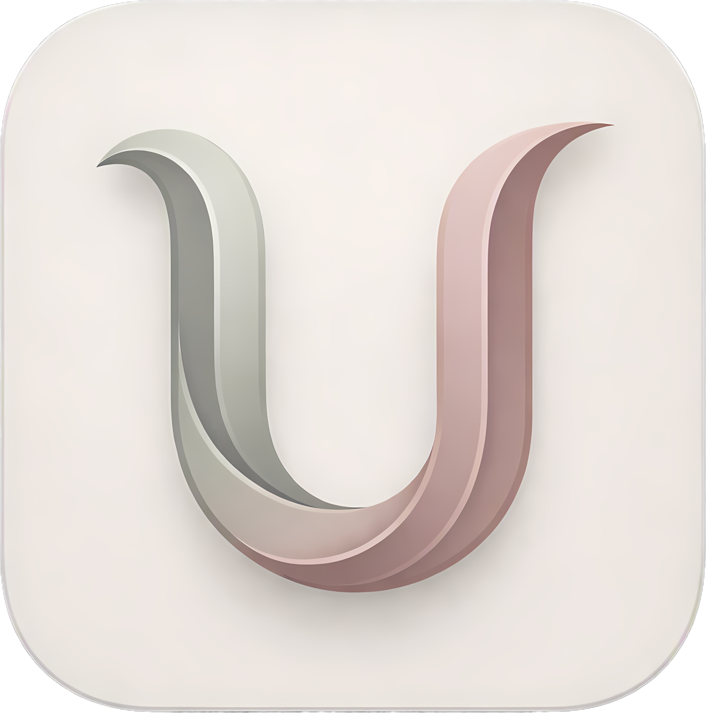

  

  <h1>uMortux</h1>

  
 <!-- 软件基础属性 -->     
 
 <!-- 核心技术栈 -->     
  

## 更新日志

### 2026-08-28
* 发布版本 v0.1.0@Default

---

## 核心模块与功能

### Dashboard
* **待办事项**：显示课程的待办作业与测验
* **动态通知**：显示最近通知
* **访问记录**：显示本地课程最近访问记录

### Courses
* **课程列表**：显示课程列表
* **课程详情**：支持基础课程信息查看
* **测验记录**：支持查看单选、多选试题

### Videos
* **日历视图**：以日历形式展示每日的课程安排
* **录播播放**：内置播放器，支持倍速、画中画、全屏
* **PPT下载**：支持PPT下载
* **缓存下载**：支持缓存录播课视频至本地

### Scores
* **成绩查询**：显示成绩

### Files
* **文件管理**：支持上传、下载、重命名、删除；支持按文档、图片、音视频等分类检索
* **内置预览**：软件支持直接预览主流文档（PDF/Word/PPT）、图片、音视频文件

### Transfers
* **断点续传**：课件下载、视频缓存、云盘上传均由底层传输引擎接管，支持暂停、恢复、取消操作

---

## 使用说明

1. **环境准备**：
   * 确保电脑已连接互联网
2. **账号登录**：
   * 按照指示安装 uMortux，启动并输入浙大统一身份认证账号与密码
   * 建议在私人电脑上勾选“记住密码”，以提升使用体验

---
